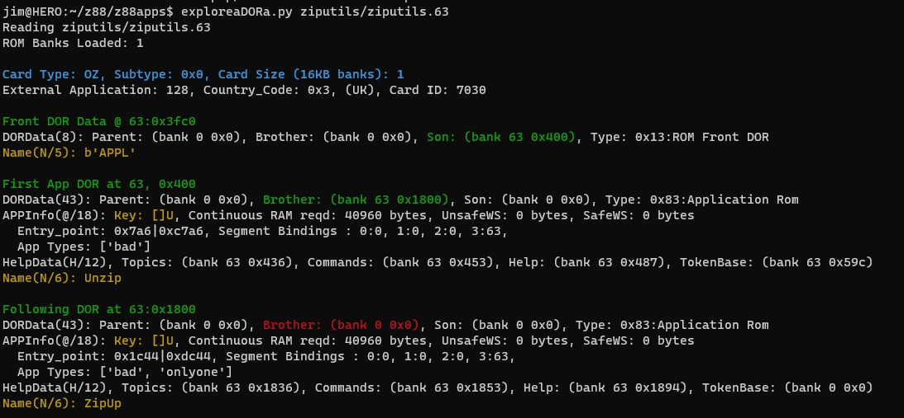
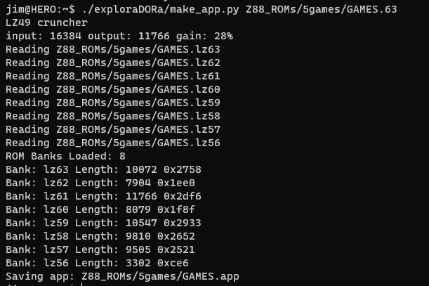

# exploraDORa

Some tools for exploring Cambridge Z88 ROM and App Files and their DOR structure.

The Z88 uses DOR (Directory Object Records) for information stored within EPROM or FLASH cards.
Some ROM cards are multi-application and have a linked-list of DOR records which contain information
about each application and the start adrress to run it.

This repo contains some tools I wrote whilst I was investigating the DOR structure so that I could pack
applicaitons more tightly onto an EPROM card.

## ExploraDORa

Prints out the DOR structure for Appplication ROMs to show details about all of the apps and DOR records. 
Handy when you're manually hacking DOR records in a hex editor.

## make_app.py

Takes ROM image files in .63, .62 format and packages them together as a Compressed RAM app.
Requires the 'lz49' binary from [MPM](https://gitlab.com/b4works/mpm/-/releases) to be in your $path.

Generates app header and concatenates together multiple .63, .62 ROM image files or .lz0,.lz1...  app files into a single compressed app.

